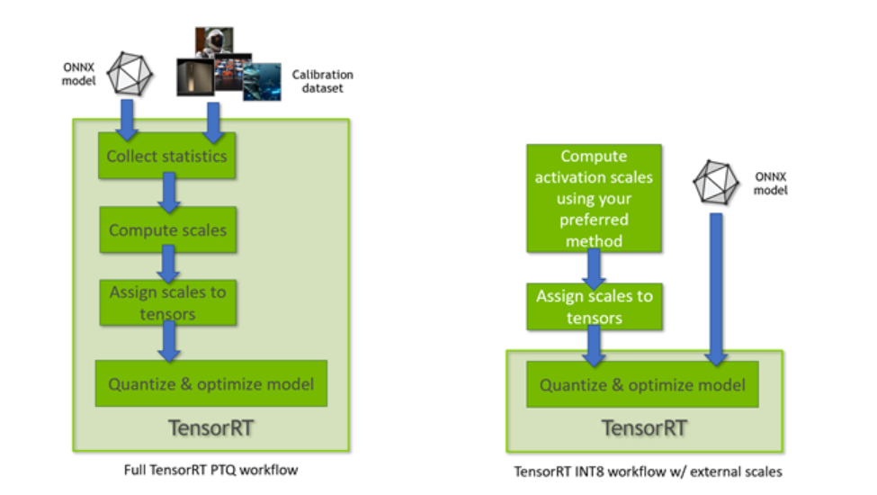

## 量化

### tensorrt-ptq



* fp16

build:

```
trtexec --onnx=best.onnx --saveEngine=best.engine --fp16
```

test:

```
trtexec --loadEngine=best.engine 
```

这里也可以使用py/cpp脚本实现：

```
python trt-ptq-engine.py --has-half=True
```

* int8

```
python trt-ptq-engine.py --has-int8=True --calib_path=data/calib_images
```

trt-ptq 采用**IInt8EntropyCalibrator2**校准方法，voc数据掉1-3个点，虽然掉点比较多，但是训练后量化（ptq)方式操作简单，infer速度快，可迅速变现。但ptq **无法控制某一层的精度**，如果我们需要更为精细的量化操作，可关注下qat。

